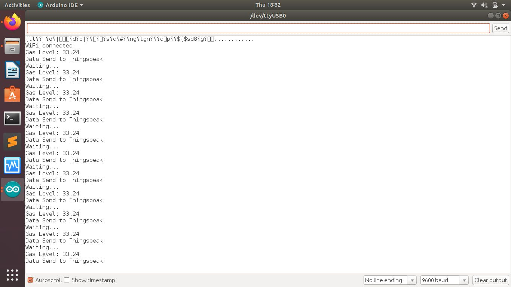
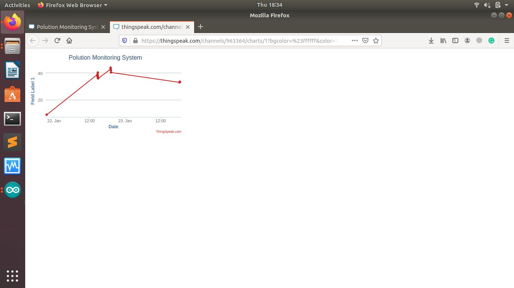
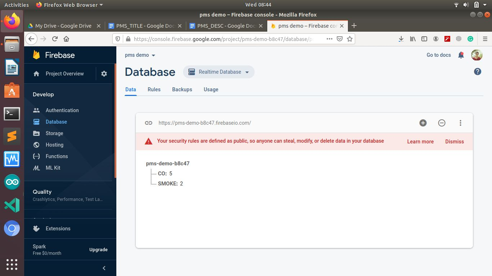
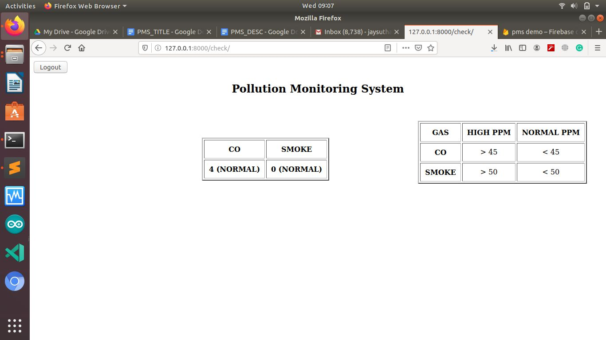

# Pollution-Monitoring-System
The air pollution is becoming a critical condition in urban areas. The number of
Carbon particles are increasing day by day to a modern lifestyle. It is advised to
use an IoT enabled solution to monitor the volume of carbon particles in the air.

### Scope:
● Detects, Measures the level of emitted Carbon gas and Smoke. 
● Gas Sensor MQ2 to detect CO and Smoke.

### Objectives:

● To monitor the level of carbon gas emission into the air. 
● To give continuous notification about the volume of carbon gas.

### Tools & Technology:

* **Programming language:**  Arduino
* **Operating system (Development):** Linux Ubuntu
* **IDE:** ​ Arduino IDE
* **Device:**
  NodeMCU(Part no- ESP8266MOD)
* **Sensor:**
Gas Sensor(Part no- MQ2)
* **Library:** ​ ​ ESP8266WiFi, MQ2, Wi-Fi
* **Other tools:**
Kodular App Inventor(Mobile-App), 
         Django-python(Web-APP)

### Screen Layouts

 

 

### Reference:

Python3: ​ https://www.python.org/  
MQ-2 Sensor: ​ https://drive.google.com/file/d/1g1IwiKZ6lZj5G98-dElObNG0yIXPPzwl/view 
NodeMcu Working: ​ https://lastminuteengineers.com/esp8266-nodemcu-arduino-tutorial/

